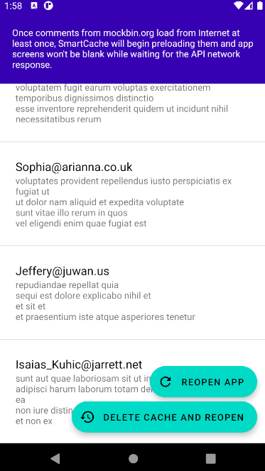

## SmartCache - preloaded responses for Retrofit 2 [](https://travis-ci.org/dimitrovskif/SmartCache)

#### This library calls your callback twice: first cached, then fresh data 

Instead of showing an empty screen while waiting for a network response, why not load the latest successful response from storage? 

* Responses are saved in device storage & RAM
* No extra logic, only `Call<T>` becomes `SmartCall<T>`
* Extend your own adapters for other caching strategies

### Install and use

1. Add SmartCache to Gradle dependencies, and JitPack to repos:
```groovy
repositories {
    ...
    maven { url "https://jitpack.io" }
}
    
dependencies {
    implementation 'com.squareup.retrofit2:retrofit:2.9.0'
    implementation 'com.github.dimitrovskif:SmartCache:0.2'
}
```

2. Add `SmartCallFactory` to your Retrofit `Builder`:
```java
Retrofit retrofit = new Retrofit.Builder()
        .baseUrl("https://your-api.org")
        .addConverterFactory(GsonConverterFactory.create())
        .addCallAdapterFactory(SmartCallFactory.createBasic(this)) // <-- Add this!
        .build();
 ```
 
3. Replace `Call<T>` with `SmartCall<T>`.
```java
public interface GitHubService {
  @GET("/users/{user}/repos")
  SmartCall<List<Repo>> listRepos(@Path("user") String user);
}
```

### Checking if the callback data is preloaded

The preloaded data callback is fired before the network callback. You can check which is which using
`SmartCache.isResponseFromNetwork(response)`:

```java
enqueue(new Callback<YourModel>() {
  @Override
  public void onResponse(Call<List<Comment>> call, Response<List<Comment>> response) {
    if(SmartCache.isResponseFromNetwork(response)) { ...
```

### Demo app

For a complete example check [demoapp/](/demoapp).



### How it works


One request corresponds to two responses: a cache response and a network response. Loading content from your phone is faster than loading from network; therefore your app will show stale content while waiting for a fresh network response. (*Note:* If the network response comes first, cache won't happen.)

Help needed from contributors:

* Make it work with RxJava
* Implement a pool of threads

### License

    Copyright 2015-2021 Filip Dimitrovski

    Licensed under the Apache License, Version 2.0 (the "License");
    you may not use this file except in compliance with the License.
    You may obtain a copy of the License at

       http://www.apache.org/licenses/LICENSE-2.0

    Unless required by applicable law or agreed to in writing, software
    distributed under the License is distributed on an "AS IS" BASIS,
    WITHOUT WARRANTIES OR CONDITIONS OF ANY KIND, either express or implied.
    See the License for the specific language governing permissions and
    limitations under the License.
